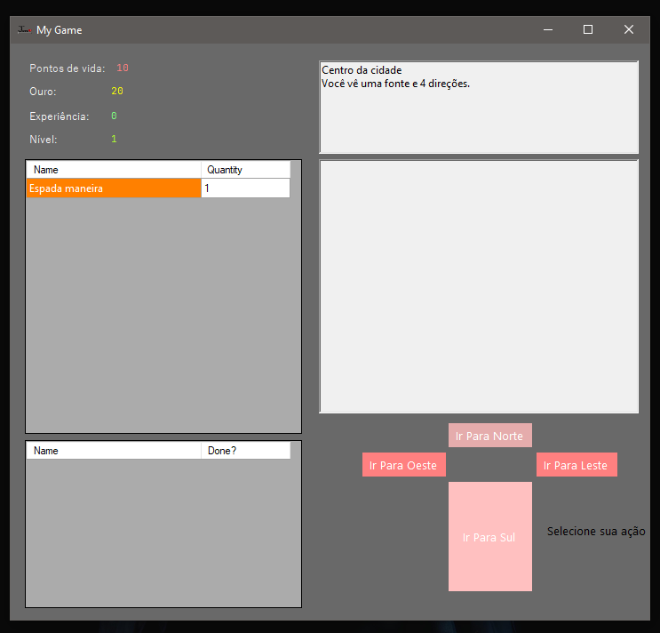
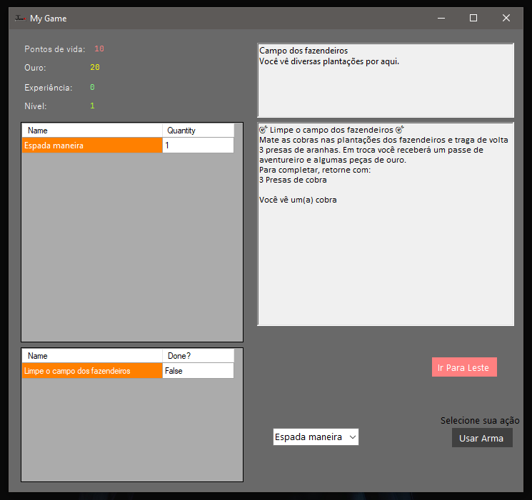
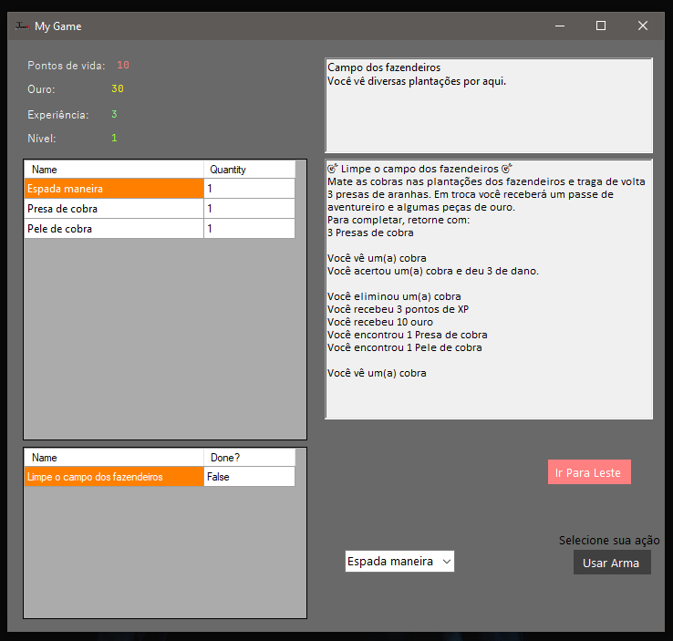

# JRPG - C# Windows Forms Adventure

> Um RPG de aventura baseado em turnos e exploração, desenvolvido em C# com Windows Forms.


## 📖 Sobre o Projeto

Este projeto é um jogo de RPG clássico onde o jogador explora um mundo interconectado, batalha contra monstros, coleta itens e completa missões (quests). O objetivo foi aplicar conceitos fundamentais de **Programação Orientada a Objetos (POO)** e desenvolvimento de interfaces desktop com **Windows Forms**.

O jogo apresenta um sistema de combate, inventário dinâmico e progressão de personagem.

## 🎮 Funcionalidades

* **Exploração de Mundo:** Navegação entre diferentes locais (Norte, Sul, Leste, Oeste) interligados logicamente.
* **Sistema de Combate:** Batalhas por turnos contra inimigos (Ratos, Cobras, Aranhas Gigantes) com cálculo de dano variável.
* **Inventário e Itens:**
    * Coleta de itens (Loot) após batalhas.
    * Uso de poções de cura.
    * Equipar diferentes armas.
* **Sistema de Missões (Quests):** Aceite missões de NPCs, colete os itens necessários e receba recompensas (XP, Ouro e Itens).
* **Progressão:** Sistema de níveis, experiência (XP) e acumulação de ouro.
* **Geração Aleatória Segura:** Uso de criptografia (`RNGCryptoServiceProvider`) para cálculos precisos de RNG (Random Number Generation).

## 🛠️ Arquitetura e Estrutura do Código

O projeto segue uma estrutura organizada baseada em classes e objetos:

### Principais Classes (`/objetos`)
* **`mundo.cs`**: Classe estática que atua como o "Game Manager", instanciando todos os itens, monstros, quests e locais ao iniciar o jogo.
* **`criaturaViva.cs`**: Classe base (Pai) que define atributos comuns como HP Atual e HP Máximo.
* **`Player.cs`**: Herda de `criaturaViva`. Gerencia inventário, missões ativas e movimentação.
* **`monstros.cs`**: Herda de `criaturaViva`. Define tabelas de loot e dano dos inimigos.
* **`local.cs`**: Representa os nós do mapa, contendo referências para os locais vizinhos e monstros/quests disponíveis na área.
* **`item.cs` / `arma.cs` / `healingPot.cs`**: Hierarquia de classes para gerenciamento de itens.

### Lógica de UI (`Engine.cs`)
A classe `Engine` (Formulário Principal) gerencia a interação entre a lógica de negócios (classes acima) e a interface gráfica, atualizando logs de texto (`RichTextBox`) e grids de inventário (`DataGridView`).

## 🚀 Como Executar

### Pré-requisitos
* Visual Studio 2019 ou superior.
* .NET Framework 4.7.2.

### Passos
1.  Clone este repositório:
    ```bash
    git clone [https://github.com/seu-usuario/jogoRPG.git](https://github.com/seu-usuario/jogoRPG.git)
    ```
2.  Abra o arquivo de solução `jogoRPG.sln` ou `jogoRPG.slnx` no Visual Studio.
3.  Compile a solução (Ctrl + Shift + B).
4.  Execute o projeto (F5).

## 🕹️ Controles

* **Botões Direcionais:** Movem o personagem pelo mapa.
* **Usar Arma:** Ataca o monstro atual (habilitado apenas em combate).
* **Usar Poção:** Recupera pontos de vida (consome item do inventário).
* **Inventário/Missões:** Visualização passiva do status do jogador.

## 📸 Screenshots





---
Desenvolvido por [Rafael Dos Santos]
